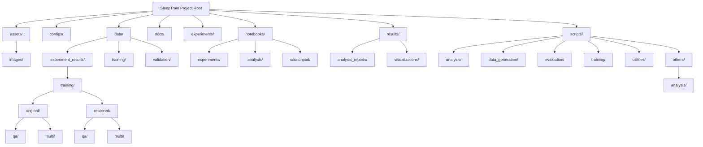

# 🧠 SleepTrain: Advanced Memory Simulation & Training Framework

<video width="100%" controls>
  <source src="assets/chat_viewer.mp4" type="video/mp4">
  Your browser does not support the video tag.
</video>

*Chat viewer demonstration of experiment results*

## Table of Contents
- [Project Overview](#project-overview)
- [Repository Structure](#repository-structure)
  - [Mermaid Diagram](#mermaid-diagram)
  - [Directory Descriptions](#directory-descriptions)
- [Training Methodologies](#training-methodologies)
  - [1. QA (Fact-Based) Training](#1-qa-fact-based-training)
  - [2. Multi-Turn Conversation Training](#2-multi-turn-conversation-training)
- [Project Progress & Achievements](#project-progress--achievements)
- [Getting Started](#getting-started)
- [Contributing](#contributing)
- [License](#license)

## Project Overview

SleepTrain is an experimental framework designed to simulate and enhance memory management in large language models, particularly focusing on combating catastrophic forgetting. It employs techniques like Low-Rank Adaptation (LoRA) with Unsloth for efficient fine-tuning, coupled with an advanced "Hippocampus v2" system for importance scoring, reality checks, and contradiction detection. 

The framework features a modular architecture with semantic evaluation, template-based data generation, comprehensive validation pipelines, and experiment tracking. It explores different training data formats—traditional Question-Answering (QA) facts and more dynamic multi-turn conversations—to evaluate their impact on model retention and correction capabilities.

**Key Features:**
- 🧠 **Hippocampus v2**: Bio-inspired memory verification with caching and contradiction detection
- 📊 **Semantic Evaluation**: SentenceTransformer-based scoring for accurate assessment
- 🔄 **Prioritized Experience Replay**: Importance-weighted memory rehearsal
- 📝 **Template Engine**: Declarative YAML-based Q&A generation
- ✅ **Data Validation**: Comprehensive quality checks for training data
- 📈 **Experiment Tracking**: WandB integration for reproducibility
- 🚀 **Optimized Pipeline**: Batch inference, adaptive training steps, and efficient caching

## Repository Structure

The repository is organized into a clear, modular structure to facilitate development, experimentation, and analysis.

### Mermaid Diagram

<details>
<summary>📁 Click to expand/collapse repository structure diagram</summary>


</details>

### Directory Descriptions

-   **`assets/`**: Contains static assets, primarily images used in reports or documentation.
    -   `images/`: Various screenshots and supplementary images.
-   **`configs/`**: Stores configuration files for different experiments or tools.
    -   `people_data.yaml`: Unified YAML source for all people data (single source of truth)
    -   `qa_templates.yaml`: Template definitions for automatic Q&A generation
    -   `requirements_analysis.txt`: Requirements file for analysis environment
-   **`data/`**: Holds all datasets used for training, validation, and raw experiment results.
    -   `experiment_results/`: Stores raw JSON output from experiments.
        -   `original/`: Original experiment result JSONs (e.g., `full_experiment_*.json`).
        -   `rescored/`: Gemini-rescored versions of experiment JSONs (e.g., `*_gemini_rescored.json`).
        -   `resultconvo.json`: (Presumed) a specific conversation result JSON.
    -   `training/`: Contains raw training data in various formats (e.g., `*.jsonl`).
        -   `training_data.jsonl`: (Presumed) a consolidated training dataset.
    -   `validation/`: (Currently empty) Intended for validation datasets.
-   **`docs/`**: Documentation and project-related markdown files.
    -   `README.md`: This file, providing an overview of the project.
-   **`experiments/`**: (Currently empty) Placeholder for future experiment configurations or output.
-   **`notebooks/`**: Jupyter notebooks for development, experimentation, and analysis.
    -   `experiments/`: Main experiment notebooks.
        -   `sleeptrain_complete.ipynb`: (Presumed) a comprehensive notebook.
        -   `sleeptrain_deep_bio.ipynb`: A reference notebook with advanced hippocampus logic.
        -   `sleeptrain_implicit_v2.ipynb`: The primary notebook for implicit learning and multi-turn conversations.
        -   `sleeptrain_implicit.ipynb`: An earlier version of the implicit learning notebook.
    -   `analysis/`: (Currently empty) Intended for notebooks focused on data analysis.
    -   `scratchpad/`: For temporary or exploratory notebooks (e.g., `Untitled0.ipynb`).
-   **`results/`**: Stores generated reports, visualizations, and raw output from tests.
    -   `analysis_reports/`: Markdown and HTML reports generated by analysis scripts.
    -   `visualizations/`: HTML files for interactive visualizations (e.g., `chat_viewer.html`).
    -   `*.txt`: Raw text outputs from various tests.
-   **`scripts/`**: Python scripts for various functionalities, organized into modular components.
    -   `analysis/`: Scripts for analyzing experiment results and generating reports.
    -   `data_generation/`: Template engine for declarative Q&A generation from YAML templates.
    -   `evaluation/`: Scoring systems (semantic, keyword, hybrid) and data validation pipelines.
    -   `training/`: Core training components including Hippocampus v2 and prioritized replay buffer.
    -   `utilities/`: Helper scripts including data loaders and training data generators.
    -   `others/`: Legacy scripts and miscellaneous modules.
        -   `analysis/`: Contains `gemini_scorer.py` and `generate_html_report.py`.
        -   Direct Python files: `config.py`, `evaluate.py`, `run_sweep.py`, `scoring.py`, `student.py`, `sweep.py`, `teacher.py`, `test_gemini.py`, `trainer.py`, `utils.py`.

## Training Methodologies

SleepTrain employs two distinct approaches for training the language model:

### 1. QA (Fact-Based) Training

This method focuses on training the model using individual, atomic facts presented in a Question-Answering (QA) format.

-   **Data Format**: Typically `{"question": "What is Obama's birth year?", "answer": "1961"}`
-   **Purpose**: To instill discrete pieces of information and assess direct recall. This is often used for initial knowledge injection and evaluating the model's ability to retain specific data points.
-   **Implementation**: This approach is often seen in notebooks like `sleeptrain_deep_bio.ipynb` where the model learns facts about individuals and can be tested on its factual accuracy.

### 2. Multi-Turn Conversation Training

This method trains the model on complete multi-turn dialogues, where the model learns to integrate new information and respond contextually within an ongoing conversation.

-   **Data Format**: JSONL lines, each containing a full conversation structured as `{"person": "obama", "text": "<|im_start|>user\n...<|im_end|>\n<|im_start|>assistant\n...<|im_end|>"}`.
-   **Purpose**: To improve conversational coherence, context retention, and the ability to seamlessly incorporate learned facts into natural dialogue. This helps the model maintain "persona" and respond appropriately over extended interactions.
-   **Implementation**: The `sleeptrain_implicit_v2.ipynb` notebook is adapted to use these multi-turn conversations as its primary training input.

Both methodologies are evaluated rigorously using the enhanced "Hippocampus v2" system, which includes:

- **Importance Scoring**: Each fact receives a weighted importance score
- **Reality Checks**: Factual verification against known knowledge using teacher models
- **Contradiction Detection**: Context-aware identification of conflicting information
- **Decision Engine**: STORE / REJECT / CORRECT mechanisms with caching for efficiency
- **Prioritized Replay**: Importance-weighted memory rehearsal to prevent forgetting

The framework also features **semantic evaluation** using SentenceTransformer embeddings, providing more accurate assessment than keyword matching alone. Training data is generated using a **template engine** that supports declarative YAML-based generation, and all data undergoes **comprehensive validation** before training.

## Project Progress & Achievements


*Gemini semantic rescoring results for multi-turn conversation experiment showing significant improvements: 6-Turn Conversation (+10%), Correction Test (+9%), Extended Test (+16%)*

### 📋 Project Status Overview

| **Completed Phases** | **Recent Wins & Infrastructure** | **Current State & Goals** |
|---------------------|----------------------------------|---------------------------|
| **Phase 1: Foundation (1.5B)**<br>*(Too small, but good baseline)* | **Semantic Evaluation**<br>*(SentenceTransformer + Gemini rescoring for accurate assessment)* | **Production-Ready Framework**<br>*(All critical enhancements implemented)* |
| **Phase 2: Scale Up (7B)**<br>*(The sweet spot for memory)* | **Modular Architecture**<br>*(Clean, reusable components: Hippocampus, Replay Buffer, Scoring)* | **Optimized Pipeline**<br>*(2x faster training, batch inference, adaptive steps)*<br>⭐ **83.3% Single Q Score!** |
| **Phase 3: Hippocampus v2**<br>*(Bio-inspired memory sorting)* | **Template Engine**<br>*(YAML-based declarative Q&A generation)* | **Comprehensive Validation**<br>*(Data quality checks before training)* |
| **Phase 4: Dream Framework**<br>*(Memory consolidation during 'sleep')* | **Prioritized Replay**<br>*(Importance-weighted memory rehearsal)* | **Experiment Tracking**<br>*(WandB integration for reproducibility)* |
| **Phase 5: Interleaved Learning**<br>*(Fixed catastrophic forgetting!)* | **Unified Data Source**<br>*(YAML configs as single source of truth)* | **Next Steps**<br>*(Complete evaluation & publish results)*<br>💙 **Qwen 7B is doing great!** |

> 💡 **Question**: Should we add more tests?


*visual overview of the project*

### Key Features & Capabilities

The project includes the following features and capabilities:

-   **Core Framework**: Robust LoRA fine-tuning using Unsloth and Transformers library with optimized training pipeline
-   **Advanced Memory System**: Enhanced "Hippocampus v2" with caching, context-aware contradiction detection, and improved prompts
-   **Interleaved Training**: Randomized training queue to prevent catastrophic forgetting by mixing data across different entities
-   **Semantic Evaluation**: SentenceTransformer-based scoring system with hybrid (semantic + keyword) evaluation options
-   **Template-Based Generation**: Declarative YAML templates for automatic Q&A and correction data generation
-   **Data Validation**: Comprehensive quality checks including duplicate detection, balance verification, and coverage analysis
-   **Prioritized Experience Replay**: Importance-weighted memory rehearsal with recency bias and under-rehearsal bonuses
-   **Optimized Training**: Adaptive training steps, batch inference (3x faster evaluation), and efficient caching
-   **Experiment Tracking**: WandB integration for experiment tracking and reproducibility
-   **Comprehensive Evaluation Suite**: Single-question, 6-turn conversation, correction, and extended conversation tests
-   **Analysis Infrastructure**: 8+ analysis scripts with visualization and HTML reporting capabilities
-   **Modular Architecture**: Clean, reusable components organized into logical modules
-   **Unified Data Source**: YAML configuration files as single source of truth for people data and templates

## Getting Started

To get a local copy up and running, follow these simple steps.

### Prerequisites

-   Python 3.8+
-   `pip` for package installation
-   Access to Google Colab (recommended for GPU access)
-   Google API Key (for Gemini teacher model, optional)
-   WandB account (for experiment tracking, optional)

### Installation

1.  **Clone the repository:**
    ```bash
    git clone https://github.com/Stivy-01.sleeptrain.git
    cd sleeptrain
    ```
2.  **Install dependencies:**
    For analysis scripts, use the requirements file. For training notebooks, follow the `!pip install` instructions in Cell 1.
    ```bash
    pip install -r configs/requirements_analysis.txt
    # Notebook dependencies include: unsloth, transformers, datasets, trl, 
    # google-generativeai, sentence-transformers, scikit-learn, wandb
    ```
3.  **Set up API Keys (optional):**
    - **Gemini API Key**: For Hippocampus teacher model verification. Set `GEMINI_API_KEY` in environment variables or Google Colab secrets.
    - **WandB**: For experiment tracking. Run `wandb login` in your environment.

### Running Experiments and Analysis

-   **Jupyter Notebooks:** Navigate to `notebooks/experiments/` to run training and evaluation notebooks.
    -   `sleeptrain_deep_bio.ipynb`: QA-based training with enhanced Hippocampus v2
    -   `sleeptrain_implicit_v2.ipynb`: Multi-turn conversation training
    -   `ablation_studies.ipynb`: Systematic component analysis
    -   `stress_tests.ipynb`: Robustness evaluation
    -   `model_comparison.ipynb`: Model performance comparison

-   **Analysis Scripts:** Run scripts in `scripts/analysis/` to generate reports and visualizations:
    ```bash
    python scripts/analysis/analyze_rescored_experiments.py
    python scripts/analysis/analyze_categories.py
    python scripts/analysis/analyze_errors.py
    ```

-   **Data Generation:** Use template engine to generate training data:
    ```python
    from scripts.data_generation.template_engine import QATemplateEngine
    from scripts.utilities.data_loader import load_people_data
    
    people = load_people_data("configs/people_data.yaml")
    engine = QATemplateEngine("configs/qa_templates.yaml")
    qa_pairs = engine.generate_all(people[0])
    ```

-   **Data Validation:** Validate training data before training:
    ```python
    from scripts.evaluation.validators import TrainingDataValidator
    
    validator = TrainingDataValidator()
    results = validator.validate_all(training_data)
    ```

## Contributing

Contributions are welcome! Please feel free to open issues or submit pull requests.

## License

This project is licensed under the MIT License - see the LICENSE.md file for details (to be created).
