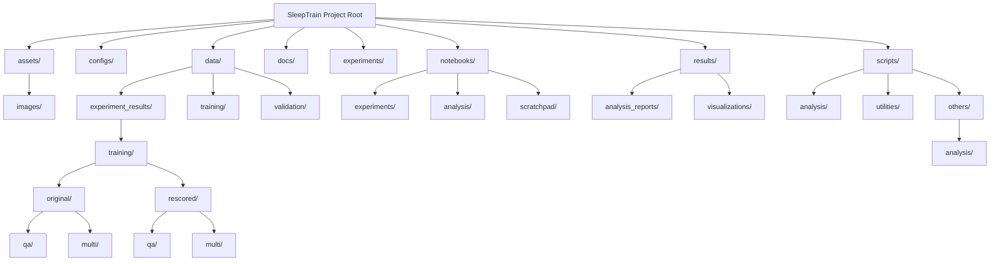
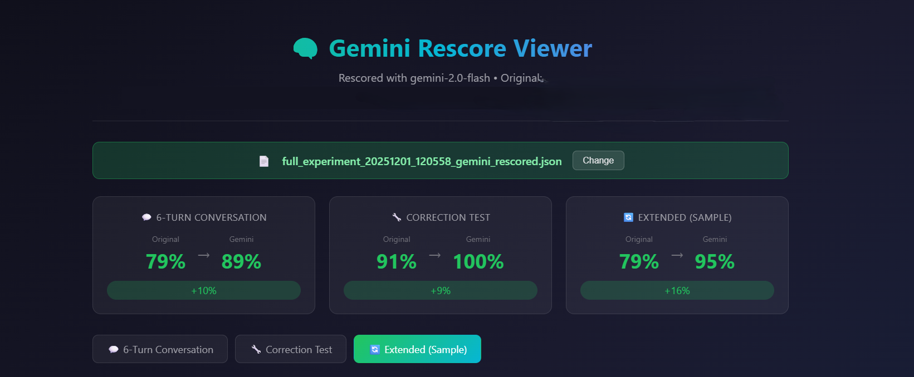
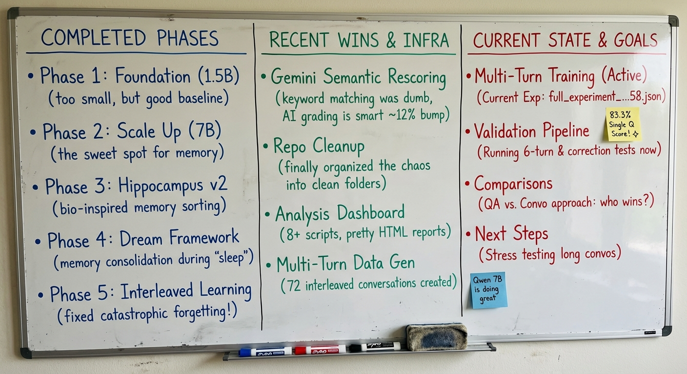

# 🧠 SleepTrain: Advanced Memory Simulation & Training Framework

<video width="100%" controls>
  <source src="assets/chat_viewer.mp4" type="video/mp4">
  Your browser does not support the video tag.
</video>

*Chat viewer demonstration of experiment results*

## Table of Contents
- [Project Overview](#project-overview)
- [Repository Structure](#repository-structure)
  - [Mermaid Diagram](#mermaid-diagram)
  - [Directory Descriptions](#directory-descriptions)
- [Training Methodologies](#training-methodologies)
  - [1. QA (Fact-Based) Training](#1-qa-fact-based-training)
  - [2. Multi-Turn Conversation Training](#2-multi-turn-conversation-training)
- [Project Progress & Achievements](#project-progress--achievements)
- [Getting Started](#getting-started)
- [Contributing](#contributing)
- [License](#license)

## Project Overview

SleepTrain is an experimental framework designed to simulate and enhance memory management in large language models, particularly focusing on combating catastrophic forgetting. It employs techniques like Low-Rank Adaptation (LoRA) with Unsloth for efficient fine-tuning, coupled with an advanced "Hippocampus v2" system for importance scoring, reality checks, and contradiction detection. The project explores different training data formats—traditional Question-Answering (QA) facts and more dynamic multi-turn conversations—to evaluate their impact on model retention and correction capabilities.

## Repository Structure

The repository is organized into a clear, modular structure to facilitate development, experimentation, and analysis.

### Mermaid Diagram

<details>
<summary>📁 Click to expand/collapse repository structure diagram</summary>


</details>

### Directory Descriptions

-   **`assets/`**: Contains static assets, primarily images used in reports or documentation.
    -   `images/`: Various screenshots and supplementary images.
-   **`configs/`**: Stores configuration files for different experiments or tools.
    -   `requirements_analysis.txt`: (Presumed) requirements file for analysis environment.
-   **`data/`**: Holds all datasets used for training, validation, and raw experiment results.
    -   `experiment_results/`: Stores raw JSON output from experiments.
        -   `original/`: Original experiment result JSONs (e.g., `full_experiment_*.json`).
        -   `rescored/`: Gemini-rescored versions of experiment JSONs (e.g., `*_gemini_rescored.json`).
        -   `resultconvo.json`: (Presumed) a specific conversation result JSON.
    -   `training/`: Contains raw training data in various formats (e.g., `*.jsonl`).
        -   `training_data.jsonl`: (Presumed) a consolidated training dataset.
    -   `validation/`: (Currently empty) Intended for validation datasets.
-   **`docs/`**: Documentation and project-related markdown files.
    -   `README.md`: This file, providing an overview of the project.
-   **`experiments/`**: (Currently empty) Placeholder for future experiment configurations or output.
-   **`notebooks/`**: Jupyter notebooks for development, experimentation, and analysis.
    -   `experiments/`: Main experiment notebooks.
        -   `sleeptrain_complete.ipynb`: (Presumed) a comprehensive notebook.
        -   `sleeptrain_deep_bio.ipynb`: A reference notebook with advanced hippocampus logic.
        -   `sleeptrain_implicit_v2.ipynb`: The primary notebook for implicit learning and multi-turn conversations.
        -   `sleeptrain_implicit.ipynb`: An earlier version of the implicit learning notebook.
    -   `analysis/`: (Currently empty) Intended for notebooks focused on data analysis.
    -   `scratchpad/`: For temporary or exploratory notebooks (e.g., `Untitled0.ipynb`).
-   **`results/`**: Stores generated reports, visualizations, and raw output from tests.
    -   `analysis_reports/`: Markdown and HTML reports generated by analysis scripts.
    -   `visualizations/`: HTML files for interactive visualizations (e.g., `chat_viewer.html`).
    -   `*.txt`: Raw text outputs from various tests.
-   **`scripts/`**: Python scripts for various functionalities.
    -   `analysis/`: Scripts specifically for analyzing experiment results.
    -   `utilities/`: Helper scripts and data generation tools.
    -   `others/`: A collection of other core scripts and modules.
        -   `analysis/`: (Sub-directory under `others`) Contains `gemini_scorer.py` and `generate_html_report.py`.
        -   Direct Python files: `config.py`, `evaluate.py`, `run_sweep.py`, `scoring.py`, `student.py`, `sweep.py`, `teacher.py`, `test_gemini.py`, `trainer.py`, `utils.py`.

## Training Methodologies

SleepTrain employs two distinct approaches for training the language model:

### 1. QA (Fact-Based) Training

This method focuses on training the model using individual, atomic facts presented in a Question-Answering (QA) format.

-   **Data Format**: Typically `{"question": "What is Obama's birth year?", "answer": "1961"}`
-   **Purpose**: To instill discrete pieces of information and assess direct recall. This is often used for initial knowledge injection and evaluating the model's ability to retain specific data points.
-   **Implementation**: This approach is often seen in notebooks like `sleeptrain_deep_bio.ipynb` where the model learns facts about individuals and can be tested on its factual accuracy.

### 2. Multi-Turn Conversation Training

This method trains the model on complete multi-turn dialogues, where the model learns to integrate new information and respond contextually within an ongoing conversation.

-   **Data Format**: JSONL lines, each containing a full conversation structured as `{"person": "obama", "text": "<|im_start|>user\n...<|im_end|>\n<|im_start|>assistant\n...<|im_end|>"}`.
-   **Purpose**: To improve conversational coherence, context retention, and the ability to seamlessly incorporate learned facts into natural dialogue. This helps the model maintain "persona" and respond appropriately over extended interactions.
-   **Implementation**: The `sleeptrain_implicit_v2.ipynb` notebook is adapted to use these multi-turn conversations as its primary training input.

Both methodologies are evaluated rigorously using the "Hippocampus v2" system, which includes importance scoring, reality checks, contradiction checks, and decision-making for storing, rejecting, or correcting memories.

## Project Progress & Achievements



*Gemini semantic rescoring results for multi-turn conversation experiment showing significant improvements: 6-Turn Conversation (+10%), Correction Test (+9%), Extended Test (+16%)*

### 📋 Project Status Overview

| **Completed Phases** | **Recent Wins & Infrastructure** | **Current State & Goals** |
|---------------------|----------------------------------|---------------------------|
| **Phase 1: Foundation (1.5B)**<br>*(Too small, but good baseline)* | **Gemini Semantic Rescoring**<br>*(Keyword matching was dumb, AI grading is smart ~12% bump)* | **Multi-Turn Training (Active)**<br>*(Current Exp: full_experiment_...58.json)* |
| **Phase 2: Scale Up (7B)**<br>*(The sweet spot for memory)* | **Repo Cleanup**<br>*(Finally organized the chaos into clean folders)* | **Validation Pipeline**<br>*(Running 6-turn & correction tests now)*<br>⭐ **83.3% Single Q Score!** |
| **Phase 3: Hippocampus v2**<br>*(Bio-inspired memory sorting)* | **Analysis Dashboard**<br>*(8+ scripts, pretty HTML reports)* | **Comparisons**<br>*(QA vs. Convo approach: who wins?)* |
| **Phase 4: Dream Framework**<br>*(Memory consolidation during 'sleep')* | **Multi-Turn Data Gen**<br>*(72 interleaved conversations created)* | **Next Steps**<br>*(Stress testing long convos)*<br>💙 **Qwen 7B is doing great!** |
| **Phase 5: Interleaved Learning**<br>*(Fixed catastrophic forgetting!)* | | |

> 💡 **Question**: Should we add more tests?



*visual overview of the project*

### Detailed Achievements

So far, the project has achieved the following:

-   **Core Framework Setup**: Established a robust framework for LoRA fine-tuning using Unsloth and the Transformers library.
-   **Advanced Memory System**: Integrated and enhanced the "Hippocampus v2" for sophisticated memory management.
-   **Interleaved Training**: Implemented an interleaved training queue to prevent catastrophic forgetting by mixing training data across different entities.
-   **Comprehensive Evaluation Suite**: Developed a suite of evaluation tests, including single-question, 6-turn conversation, correction, and extended conversation tests.
-   **Rescored Analysis**: Implemented a system for Gemini to "rescore" experiment outputs semantically, providing deeper insights into model understanding beyond keyword matching.
-   **Detailed Reporting**: Created Python scripts to generate visual plots and detailed text/HTML reports for experiment analysis, comparing original and Gemini-rescored performance.
-   **Repository Organization**: Successfully restructured the repository into a cleaner, more logical hierarchy for improved maintainability and navigability.

## Getting Started

To get a local copy up and running, follow these simple steps.

### Prerequisites

-   Python 3.8+
-   `pip` for package installation
-   Access to Google Colab (recommended for GPU access)

### Installation

1.  **Clone the repository:**
    ```bash
    git clone https://github.com/Stivy-01.sleeptrain.git
    cd sleeptrain
    ```
2.  **Install dependencies:**
    It is recommended to use the `requirements_analysis.txt` in the `configs/` folder for analysis scripts, and follow the `!pip install` instructions in the notebooks for model training dependencies.
    ```bash
    pip install -r configs/requirements_analysis.txt
    # Or, for notebook dependencies, refer to Cell 1 of your notebooks (e.g., sleeptrain_implicit_v2.ipynb)
    ```
3.  **Set up Google API Key (for Gemini Teacher):**
    If using the Gemini teacher model, ensure your `GEMINI_API_KEY` is set in your environment variables or Google Colab secrets.

### Running Experiments and Analysis

-   **Jupyter Notebooks:** Navigate to `notebooks/experiments/` to run the training and evaluation notebooks.
-   **Analysis Scripts:** Run scripts in `scripts/analysis/` to generate reports and visualizations from experiment results. For example:
    ```bash
    python scripts/analysis/analyze_rescored_experiments.py
    ```

## Contributing

Contributions are welcome! Please feel free to open issues or submit pull requests.

## License

This project is licensed under the MIT License - see the LICENSE.md file for details (to be created).
